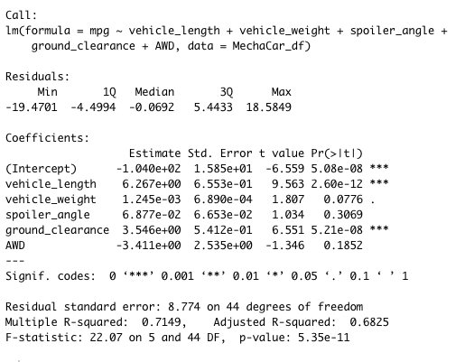
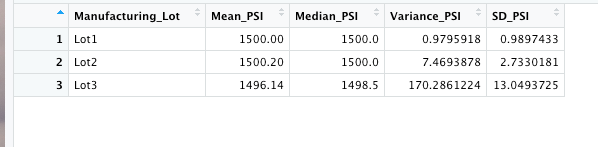

# MechaCar_Statistical_Analysis

 The purpose of this analysis was to review the prodcution data anf assume actionable insights from the data. Linear regression, summary statistics, and t-tests are used in this analysis. 
 
### Results
 

 

-  As seen in the figure above, Vehicle_weight, spoiler_angle, and AWD provide non-random values. 

- Per the value of '5.35e-11 , the slope of this model is not zero.

- The multuple R- squared metric is ~71.49% and the P-value is less than .05. Concluding for now the test is indeed effective. 

   

 

If consdering the total variance, then PSI meets the specifcation of less than 100 PSI. However, after segmenting the data, we can see lot 3 PSI is almost double the design specifcation of 100 PSI. 

### T-Tests on Suspension Coils

![] (resources/deliverable3.png)

- The p-value from lot 1 and lot 2 is less than .05, meaning we can assume the PSI values are not statiscally different. Lot 3 assumed a p-value of .04168. Acceptng the assertion that the PSI is indeed statiscally different from the population. 

### Study Design: MechaCar vs Competition

  Fuel effiency and cost of maintenance would be crucial factors to investigate for a automobile. 

 
 

